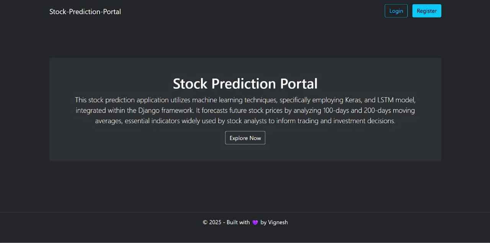
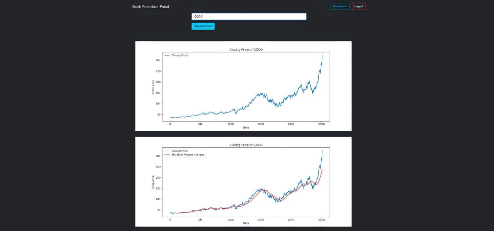
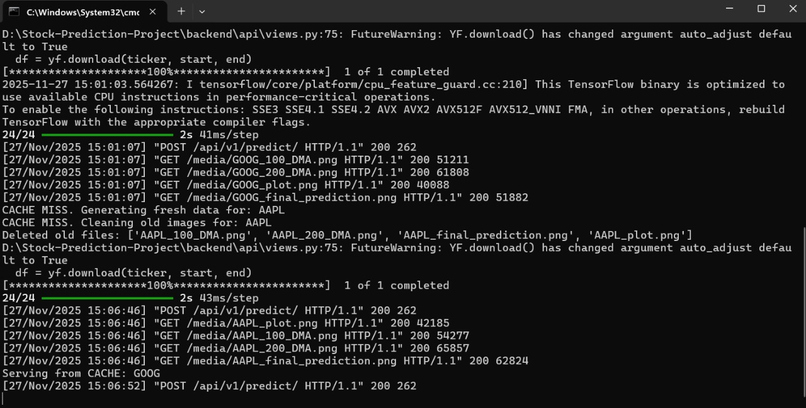

# 📈 Stock Prediction Web Application (Django + Vite + React + LSTM)

A full-stack Machine Learning project built using **Django REST Framework**, **Vite + React**, and an **LSTM neural network model**.

🚨 **Important Note — This is NOT a future forecasting application.**  
The model **does not predict unknown / upcoming future prices.**  
It only predicts the **known test portion (30%)** of historical data to evaluate model accuracy.

✔ Trained on 70% old data  
✔ Tested on 30% known future data  
✔ Evaluated using MSE, RMSE, R²  
✔ Visual comparison between **Actual vs Predicted**

This project demonstrates **ML evaluation**, **visual insights**, and a **full-stack architecture**, not real-time stock forecasting.

## 🖼️ Screenshots

### 🏠 Homepage  


---

### 📊 Prediction Page — User Input UI  


---

### 📉 Prediction Page — Graph Outputs  


---

### ⚡ Redis Cache Workflow (Terminal Output)  



# 🚀 Features

### 🔹 Machine Learning (LSTM Model)
- Uses last **100 days sliding windows**
- Trained on **70% historical data**
- Tested on **remaining 30% known data**
- Evaluates model performance (NOT future prediction)
- Generates:
  - Closing Price graph  
  - 100-Day Moving Average  
  - 200-Day Moving Average  
  - Actual vs Predicted graph  
- Metrics returned:
  - **MSE**, **RMSE**, **R²**

---

# 🔙 Backend — Django REST API

### Endpoint:
```

POST /api/v1/predict/

````

### Request:
```json
{
  "ticker": "GOOG"
}
````

### Response (example):

```json
{
  "status": "success",
  "plot_img": "/media/GOOG_plot.png",
  "plot_100_dma": "/media/GOOG_100_DMA.png",
  "plot_200_dma": "/media/GOOG_200_DMA.png",
  "plot_prediction": "/media/GOOG_final_prediction.png",
  "mse": 12.57,
  "rmse": 3.54,
  "r2": 0.93
}
```

---

# 🎨 Frontend — Vite + React + Bootstrap

* Built using **Vite** for fast development & build performance
* Uses **Bootstrap 5 CDN** for responsiveness
* Sends stock ticker to Django API
* Displays:

  * All plots
  * ML metrics
  * Model evaluation explanation
* Fully mobile-responsive UI

### Start frontend:

```bash
cd frontend
npm install
npm run dev
```

Runs at:

```
http://localhost:5173
```

---

# ⚙️ Backend Setup (Django)

```bash
cd backend
python -m venv env
env\Scripts\activate
pip install -r requirements.txt
python manage.py migrate
python manage.py runserver
```

Runs at:

```
http://127.0.0.1:8000
```

---

# ⚡ Redis Caching (Optional)

### What Redis does:

* Caches the **entire response** of a ticker for **6 hours**
* Prevents recomputing the ML model repeatedly
* Automatically deletes old plot files before regeneration

This makes the backend extremely fast for repeated requests.

---

# 📁 Project Structure

```
stock-Prediction-Project/
│
├── backend/
│   ├── api/
│   ├── accounts/
│   ├── project/
│   ├── media/
│   ├── stock_prediction_trained_model.keras
│   ├── requirements.txt
│   └── manage.py
│
├── frontend/   (Vite + React)
│   ├── src/
│   ├── index.html
│   └── package.json
│
└── screenshots/
    ├── HomePage.jpg
    ├── prediction_page_ui.jpg
    ├── prediction_page_ui2.jpg
    └── cache_workflow_terminal.jpg
```

---

# 📊 Model Evaluation Metrics

Your backend calculates:

* **MSE (Mean Squared Error)**
* **RMSE (Root Mean Squared Error)**
* **R² Score**
* **Visual prediction accuracy** using (y_test vs y_predicted)

These help verify how well the LSTM model learned historical patterns.

---

# 🛠️ Tech Stack

### **Frontend**

* Vite
* React
* JavaScript ES6
* Bootstrap (CDN)
* Axios

### **Backend**

* Django
* Django REST Framework
* TensorFlow / Keras
* NumPy, Pandas
* Matplotlib
* scikit-learn
* yfinance
* Redis (optional)

---

# 📜 License

Open-source & free to use.

---

# 👨‍💻 Author

**Vignesh J**
Software Developer • Machine Learning • Django • React

---
